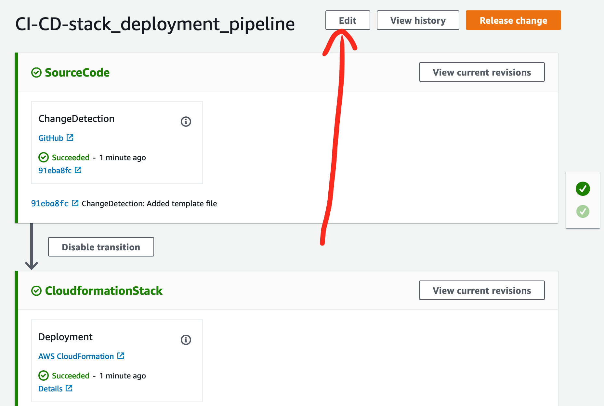
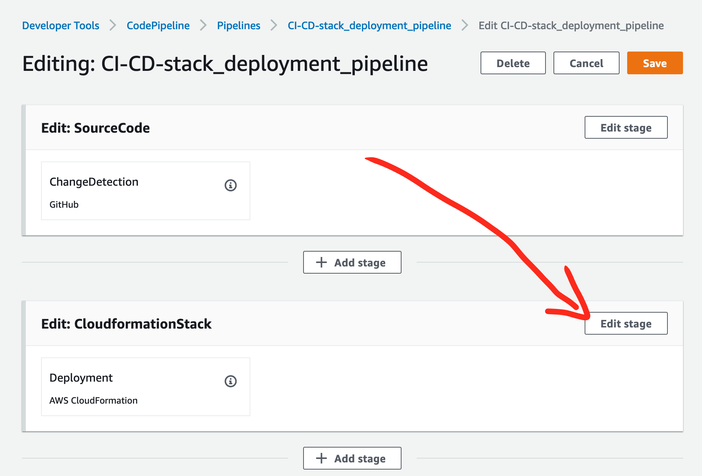
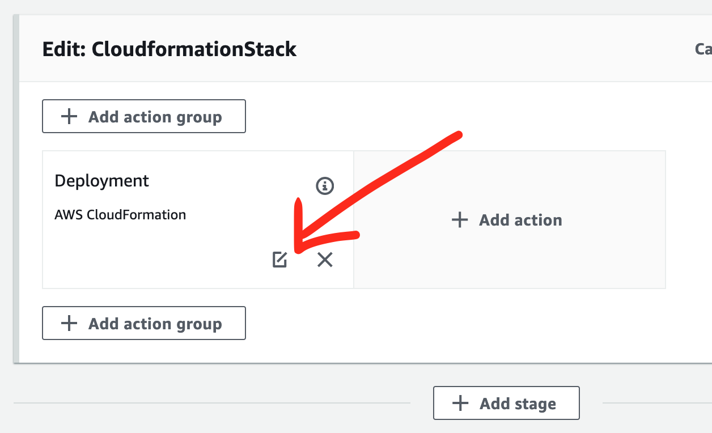
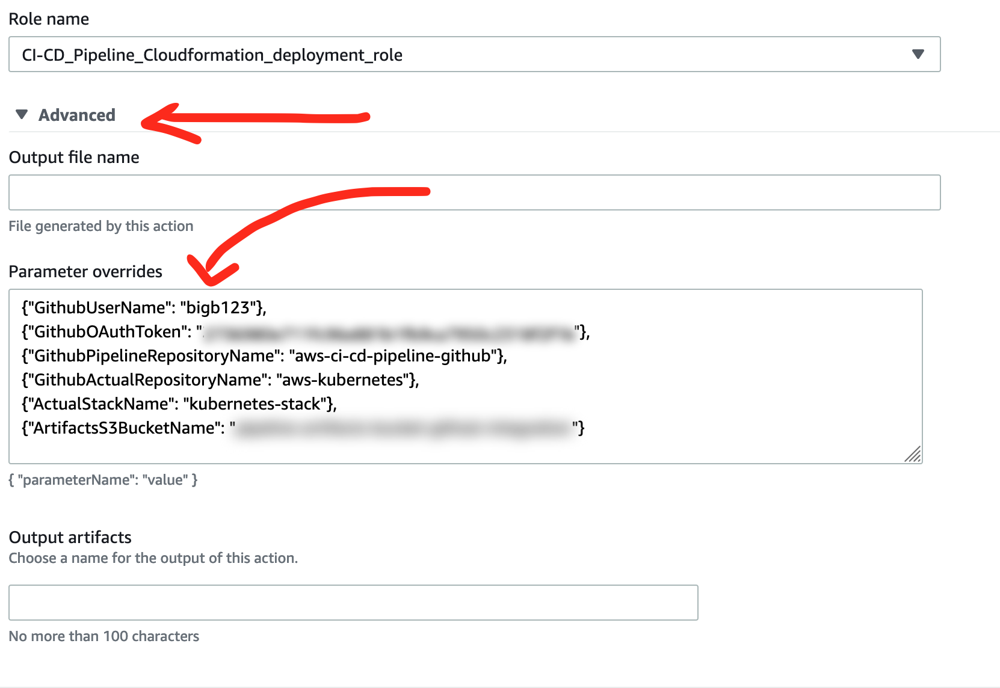

# aws-ci-cd-pipeline-github
AWS Cloudformation that creates ci/cd pipeline supported by github as a code
storage and source of events.

First deployment of this stack on cloudformation has to be done manually in
order to make it work.

After first deployment update pipeline configuration overriding Cloudformation
parameters to make sure the stack can be deployed automatically in the future.
Step by step solution is presented below.

# Overriding Cloudformation parameters in CodePipeline

1. Open CodePipeline console and edit it.
  
1. Edit Cloudformation deployment stage.
  
1. Edit Deployment action.
  
1. Expand "Advanced" options and provide overrides for Cloudformation parameters.
  

You can use template below to fill the form:
```
{
  "GithubUserName": "",
  "GithubOAuthToken": "",
  "GithubPipelineRepositoryName": "",
  "GithubActualRepositoryName": "",
  "ActualStackName": "",
  "ArtifactsS3BucketName": ""
}
```
